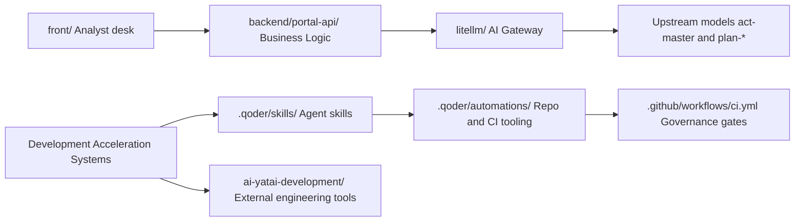

# Yataí Finance — Agent Orchestration

**Version:** 3.1 | **Review:** 2026-10-04

This document defines the specialized agent architecture of the Yataí Finance system and how they are orchestrated to perform specific tasks, including explanations about integrated AI systems and practical examples.

---

## Multi-Agent Architecture and Orchestration

### Overview of AI Architecture

The Yataí Finance AI architecture operates on **two distinct levels**, with clearly separated purposes, responsibilities, and execution contexts:



#### 1. Product-Integrated AI Systems

These are components **executed in production** as part of the normal Yataí Finance flow:

| # | Component | Location | Responsibility |
| - | ---------------------------------- | --------------------------- | --------------------------------------------------------------------------------------------------------------------------- |
| 1 | **Backend / Business Logic** | `backend/portal-api/` | Credit rules, document analysis, memorandum generation, real-time compliance (`routers`, `services`, `predictive`) |
| 2 | **Analyst desk** | `front/` | The human decision surface — dossier and reasoning-trail presentation |
| 3 | **AI Gateway** | `litellm/` | LiteLLM configuration routing requests to the AI models (`litellm/config/config.yaml`: `act-master`, `plan-*` family) |
| 4 | **Product agent behavior** | `docs/ai_studio_package/` | System prompt, tool definitions and guardrails of the business persona — specification only, no runtime |

✅ **Characteristics**:

- Part of the system's execution stack
- Subject to production governance (SLA, monitoring, auditing)
- Processed data is transactional (e.g.: credit dossier)

#### 2. Development Acceleration Systems

These are tools **external to the product**, used only during the development cycle:

| # | Component | Location | Responsibility |
| - | --------------------------------- | ----------------------------------------------- | -------------------------------------------------------------------------------------------------------------------------------------------------------- |
| 1 | **Agent skills (governed)** | `.qoder/skills/`, `.github/skills/` | Development workflows — feature design, implementation, review, commit preparation, document generation |
| 2 | **Repo and CI tooling** | `.qoder/automations/` | Governance header validation, report generators, drift gates, commit/branch helpers — invoked by skills, git hooks and CI, never by the product runtime |
| 3 | **Engineering Tools** | `ai-yatai-development/` (separate repository) | Automatic PR review, test generation, documentation synthesis |

✅ **Characteristics**:

- The governed skills and tooling live **in** this repository; `ai-yatai-development/` does not
- Executed only in development environments; the product never imports them at runtime
- Processed data is engineering metadata (code, docs, git history) — never a credit dossier

---

### Central Orchestrator

The main system acts as the Central Orchestrator. For specialized tasks, it delegates to specialized agents (sub-agents) or assumes different roles as needed.

### Specialized Agents (5 Domain Engines)

This table defines the specialized domain engines orchestrated in the credit evaluation process:

| # | Agent / Specialty | Responsibility | Trigger of Activation | Status |
| - | :-------------------------------- | :---------------------------------------------------------------------------------------------------------------- | :-------------------------------------------------- | :------------------------------------------------------------------------------------------------------------------------- |
| 1 | **Data Collection Agent** | PDF multimodal extraction, SCR Bacen indebtedness query, Open Finance statements, crop yield & CEPEA/CBOT commodity pricing with bitemporal discipline | New application intake or document upload | Implemented in sibling demo (`dataCollectionService.ts`); portal-api integration target |
| 2 | **Compliance & Socioenvironmental Agent** | CAR land registry polygons, DETER deforestation alerts, IBAMA embargoes, legal reserve, PEP/OFAC restrictive lists & internal credit policies | Automated gate post-data collection | Implemented in sibling demo (`complianceService.ts` / `geoVerificationService.ts`); portal-api target |
| 3 | **Agro Risk Agent** | Water balance, NDVI satellite vegetative health index, harvest seasonality, expected yield loss and price risk/hedge ratio | Agro credit pipeline execution | Implemented in sibling demo (`agroRiskService.ts`); portal-api target |
| 4 | **Financial Analysis Agent** | Mathematical modeling of CADS (Cash Available for Debt Service), harvest/off-season DSCR, leverage and liquidity shortfall | Credit math evaluation (`credit_math.py`) | Implemented in sibling demo (`financialAnalysisService.ts` / `creditMath.ts`) and `predictive/domain/credit_math.py` |
| 5 | **Credit Opinion & HITL Agent** | Synthesis of domain findings, mitigation covenants formulation, Human-in-the-Loop committee dossier & technical PDF memo | Deliberation & human sign-off | Implemented in sibling demo (`opinionService.ts` / `LoanDecisionAgent`); `AIService.generate_memorandum` in portal-api |

Orchestration between these agents in production is plain Python in `portal-api` (see PD-1 below), not an agent framework. The multi-step credit pipeline implemented and tested in `small-business-loan-agent` (document extraction → geo verification → underwriting → pricing → decision) is the **reference implementation for this layer** — it lives in `backend/portal-api/` as deterministic business logic, never in `.qoder/automations/`.

---

## Explanation about Weblate and AI

### Weblate

Weblate is a localization platform focused on managing translations and internationalization workflows. **Traditional Weblate does not use AI** - it's a platform dedicated to managing human translations.

However, the Yataí Finance project has automation for internationalization management, as demonstrated by the script `.qoder/automations/check_i18n_drift.mjs`, which verifies consistency in translation files. Note: this is **development-cycle tooling** (a CI/skill drift gate), not a product runtime component.

### Credit Analysis Agents

There are **no credit analysis agents in `.qoder/automations/`**. That directory contains repo/CI tooling invoked by Qoder skills, git hooks (`.husky/post-commit.mjs`) and CI gates (`.github/workflows/ci.yml`) — verified against every skill→automation caller and against `backend/portal-api/Dockerfile`, which packages only the Python service.

What exists in the production product is implemented in `backend/portal-api/src/services/`:

- **Document analysis** — `AIService.analyze_document` (single LLM completion through LiteLLM)
- **Memorandum generation** — `AIService.generate_memorandum`
- **Chat** — `AIService.generate_chat_response`

What is **specialized and orchestrated** (Data Collection, Compliance/Socioenvironmental, Agro Risk, Financial CADS/DSCR, Credit Opinion): the reference working implementation lives in the sibling project `small-business-loan-agent` (TypeScript); integration into `portal-api` lands as deterministic Python modules in `backend/portal-api/`, with the LLM restricted to bounded language tasks behind the LiteLLM gateway.

> **Known as-is deviation:** `backend/portal-api/src/services/prompts.py:192` instructs
> the LLM to "calcule ou estime" leverage/debt/DSCR ratios. Risk math belongs to deterministic code
> (see Orchestration Rules and the Autonomy section); moving it out of the prompt is an open item.

---

## Scope of Autonomy vs. Blocked Actions

### AUTONOMOUS

Performed by deterministic code, not by the LLM (the LLM may only transcribe results into text):

- DSCR / CADS / LTV calculation (`credit_math.py` / `creditMath.ts`)
- Hedge simulation & yield loss stress testing
- CAR / DETER / IBAMA overlay checks & embargo lookups
- Bitemporal snapshot assembly (SCR Bacen + Open Finance + Market Price)
- Draft memorandum & technical dossier generation
- OCR and document field validation

### SEMI-AUTONOMOUS (human review)

- Policy exceptions (`PENDING_POLICY` flags, e.g., DSCR or spot exposure deviations)
- Credit limit adjustment suggestions
- Risk tiering & APR pricing proposals

### BLOCKED (manual action required)

- Final credit approval & CPR signing
- Extrajudicial notifications
- Modification of sensitive producer records
- Overriding BLOCKED compliance findings without authenticated legal evidence

---

## Orchestration Rules

1. **HUMAN FIREWALL:** The system is a co-pilot. The final approval decision is **always up to the human analyst**.
2. **ZERO CROSS-LEAKAGE:** Stateless services. Never use data from one producer for another.
3. **NO FABRICATION:** If data is missing, report the absence. Never estimate or invent financial or environmental figures.
4. **AUDIT (XAI):** Always provide the "Reasoning Trail" (which specific data, satellites, rules, and sources were used).

---

## Pending Team Decisions

### PD-1: LangChain / ADK framework adoption (deferred from MVP1, decide post-MVP1)

**Question:** should `portal-api` adopt LangChain, LangGraph, or heavy multi-agent frameworks?

**Current stance (working assumption, not final):** No. MVP1 orchestration stays plain, deterministic code calling the LiteLLM gateway.

**Layer distinction (why this is not a LiteLLM overlap):**

| Layer | Tool | Responsibility |
| -------------------- | ---------------------- | -------------------------------------------------------------------------------------------------------- |
| Gateway (infra) | LiteLLM (`litellm/`) | Provider routing, keys, budgets, fallbacks, request logging |
| Framework (app code) | LangChain / Agent Frameworks | Prompt chaining, RAG toolkit, agent loops with tool calling and memory |

**Arguments against (for MVP1):**

1. The chained flows (collection → compliance → agro risk → financial CADS/DSCR → opinion) are sequential and deterministic.
2. An agent framework would stack on top of LiteLLM with 40+ dependencies, adding complexity and unpredictability to regulated credit calculations.
3. Fast-churning dependencies: agent framework abstractions break between minor versions.
4. Precedent: an abstraction layer over the gateway was already rejected once (`.qoder/skills-discarded/azure-aigateway/REJECTED.md`).

**Arguments for (revisit when any is true):**

1. Agent flows become branch-heavy with dynamic conversational negotiation.
2. Real enterprise RAG is needed (indexing internal credit manuals with vector-store search).
3. Multiple microservices start duplicating orchestration plumbing.

**Decision owners:** team (Maíra, Lucas, Thiago). Record the outcome here and in a decision entry when taken.

---

## Practical Example of Credit Analysis Flow

End-to-end flow with the 5 specialized domain engines:

```
[Application Upload]
         ↓
1. Data Collection Agent (PDF OCR + SCR Bacen + Open Finance + CEPEA/CBOT)
         ↓
2. Compliance & Socioenvironmental Agent (CAR vs. DETER/IBAMA + Restrictive Lists)
   ↳ IF BLOCKED → Halts flow; outputs blocking causes (e.g., active embargo)
         ↓
3. Agro Risk Agent (NDVI satelital + balanço hídrico + risco de quebra/hedge)
         ↓
4. Financial Analysis Agent (CADS + DSCR Safra/Entressafra + Alavancagem)
         ↓
[Pricing Engine] (Risk Tier 1-3 → APR % + amortização)
         ↓
5. Credit Opinion & HITL Agent (Consolidação executiva + Covenants + Laudo PDF)
         ↓
[Human Firewall] (Analista de Crédito: Aprova / Reprova / Solicita Ajuste)
```

All these components run in the product stack — `backend/portal-api/` business logic with the `litellm/` gateway for language tasks. None of them lives in `.qoder/automations/`, which is development-cycle tooling and never touches a credit dossier.

---

## How to Use This Orchestration

- **Delegation:** When a credit application is submitted, the Central Orchestrator runs the pipeline through the 5 specialized domain engines.
- **Monitoring:** All steps emit structured latency, success/failure, and decision-trail telemetry for governance.
- **Auditing:** Each decision is recorded with a bitemporal reasoning trail and exported to an auditable PDF dossier.

---

*End of Document | Yataí Finance v3.1*
