# Plano de trabalho para modelagem preditiva de crédito agro

## MVP: soja em Mato Grosso, com arquitetura expansível por cultura e região

**Autor:** Manus AI  
**Data:** 3 de setembro de 2026  
**Versão:** 3.0 — reconstruída a partir da linha de pesquisa e das três planilhas do mesmo produtor

> **Tese central:** a solução não deve ser apenas um score de CPF/CNPJ. Ela deve reconstruir o **grupo econômico**, a **operação financiada**, o **ciclo da safra**, as **posições físicas e financeiras**, as **obrigações por data**, os **ativos juridicamente disponíveis** e os **choques que alteram receita, custo, liquidez, garantias e serviço da dívida**.

Este documento é um plano técnico e empresarial, não um parecer jurídico, tributário ou agronômico. Regras legais, disponibilidade de patrimônio, garantias, sanções e decisões adversas devem passar por profissionais habilitados e governança do credor.

---

## 1. Sumário executivo

O produto recomendado é um **motor transparente de capacidade e risco por operação**, inicialmente para soja em Mato Grosso. O motor combinará regras de elegibilidade, fluxo de caixa temporal, consolidação de grupo PF/PJ/família, risco agronômico, contratos físicos, futuros e opções, câmbio, custos de insumos, logística, energia, garantias, dados socioambientais, eventos extremos e sinais geopolíticos.

O primeiro objetivo não é automatizar a concessão. É criar um dossiê reproduzível que responda cinco perguntas: **quem é o risco econômico; quanto caixa a operação gera e quando; quais obrigações podem consumir esse caixa; quais choques quebram a capacidade de pagamento; e quais ações reduzem o risco**. A decisão assistida deve preceder qualquer decisão automática.

| Pilar | Entrega inicial | Evolução posterior |
|---|---|---|
| Identidade e grupo | Grafo PF/PJ/família, dívidas, ativos e relações | Resolução probabilística e rede de contágio |
| Capacidade | Fluxo de caixa por safra e cronograma da dívida | Distribuições conjuntas e otimização de estrutura |
| Risco | Regras, cenários e baseline estatístico transparente | PD/LGD/EAD, sobrevivência e modelos desafiantes |
| Mercado | Posição física, contratos, câmbio, hedge, basis e margem | Feed intradiário, opções e stress dinâmico |
| Agronômico | Histórico, clima, solo, produtividade e cenários nomeados | Modelos por talhão e assimilação de satélite |
| Operação | Gestão, equipe, tecnologia, logística, energia e continuidade | Digital twins operacionais e rede multimodal |
| Monitoramento | Alertas associados a playbooks | Priorização dinâmica por valor e severidade |

A sequência recomendada é **MVP com um credor-âncora**, shadow mode, piloto controlado e expansão por módulos. Sem histórico de decisões e desfechos do credor, não existe base suficiente para prometer uma PD própria validada. O primeiro produto pode gerar valor com diligência, reconciliação, capacidade de pagamento, cenários e monitoramento enquanto o conjunto supervisionado amadurece.

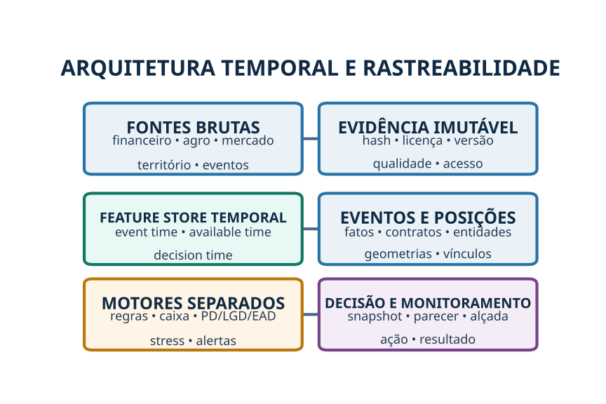

---

## 2. O que as três planilhas ensinam — e o que ainda não resolvem

O usuário confirmou que `financial_model.xlsx`, `260619-credit-model-final-checked-v11.xlsx` e `Financialmodel_lastversion.xlsx` pertencem ao **mesmo produtor**. A repetição do produtor (referido nesta documentação como `PRODUTOR_EXEMPLO`), do identificador `CASE_SYNTH_0001`, das folhas, valores e fórmulas é, portanto, uma relação confirmada, não mais uma inferência.

Como ainda não foi indicada uma versão autoritativa, o plano utiliza apenas a lógica comum e os fatos observáveis. Divergências de definição permanecem na pauta do dono do produto. Não se deve converter o nome de um arquivo — por exemplo, “final checked” — em evidência de que ele é a fonte mestre.

### 2.1 Capacidades já observadas

As planilhas já oferecem uma boa semente de produto. Há cenários do produtor, referência regional, uma base conservadora que combina menor receita e maior custo e um stress genérico. Também existem estruturas de readout, memória de cálculo, flags de auditoria e glossário em pelo menos uma das versões.

| Componente observado | Valor para o produto | Limitação atual |
|---|---|---|
| Comparação produtor versus referência | Evita aceitar projeção excessivamente otimista | Benchmark regional não substitui histórico validado do produtor |
| Base conservadora | Introduz prudência em receita e custo | Pode combinar grandezas sem preservar todas as dependências |
| Stress genérico | Demonstra sensibilidade de produtividade, preço e custo | Não representa eventos nomeados nem suas sequências de caixa |
| Readout de crédito | Organiza indicadores e condicionantes | O registro mestre da decisão não está claramente conectado |
| Memória e flags | Melhora rastreabilidade | Algumas definições de negócio continuam pendentes |

### 2.2 Camadas que serão desenvolvidas do zero

O stress atual não nomeia seca, enchente, calor, praga, choque de fertilizante, interrupção logística, guerra, sanção, falha energética, basis ou chamada de margem. Essas capacidades serão construídas do zero e não apresentadas como funcionalidades já existentes.

A nova camada precisa representar o encadeamento do evento. Por exemplo, uma alta da soja pode elevar receita para volume aberto, mas gerar ajuste diário negativo para futuro vendido. Se a produção cair e a obrigação superar a disponibilidade P10, a operação pode ficar overhedged, sofrer chamada de margem, recomprar contrato e entrar em crise de liquidez antes de receber a safra.

### 2.3 Ambiguidade do parecer final

A planilha possui um rótulo como `Preliminary decision`, mas o valor de decisão não aparece preenchido no readout revisado. Em outra área há a frase “avança condicionado”, com aparência de instrução ou orientação. Não existe evidência suficiente no arquivo para afirmar que essa frase seja o registro mestre do parecer.

A plataforma deverá separar quatro registros:

| Registro | Exemplo de conteúdo | Responsável |
|---|---|---|
| Recomendação do modelo | PD, rating, limite técnico, cenários e reason codes | Sistema/model owner |
| Parecer do analista | Recomendação, ajustes, pendências e justificativa | Analista de crédito |
| Decisão da alçada | Aprovar, reprovar ou condicionar; limite, prazo, garantia e covenants | Comitê/alçada |
| Status do workflow | Em análise, pendente, aprovado condicionado, liberado, monitorado | Operações de crédito |

Essa separação permite medir override, tempo de decisão, cumprimento de condição e desempenho por aprovador, sem confundir cálculo com ato decisório.

### 2.4 O que significa “overhead proxy de crédito”

Nas planilhas, o overhead de 30% da receita funciona como uma **aproximação prudencial** de despesas indiretas não detalhadas. Ele não equivale, por si só, a overhead contábil auditado nem a EBITDA societário. O indicador serve ao objetivo de crédito: reduzir a geração bruta por uma reserva para despesas administrativas, operacionais e retiradas que não estão integralmente abertas.

O problema é que um percentual fixo pode omitir despesas relevantes, duplicar custos já incluídos ou variar mecanicamente com a receita quando a despesa real é fixa. A evolução correta é criar uma ponte:

```text
Receita validada
− custos diretos da cultura
− frete, armazenagem, secagem e perdas
− despesas administrativas recorrentes
− mão de obra e serviços não alocados
− arrendamentos e retiradas normalizadas
− manutenção e capex obrigatório
= geração de caixa operacional para crédito
```

Enquanto a abertura não existir, o proxy poderá continuar como fallback, mas com `overhead_proxy_flag = 1`, reason code, versão e análise de sensibilidade. Nunca deve ser apresentado como número contábil apurado.

### 2.5 Problema visual `###`

No Excel, `###` normalmente aparece quando a coluna não possui largura para exibir o número ou a data. Nas cópias revisadas, isso foi tratado como problema de apresentação, não como prova de erro da fórmula. Não é necessário reenviar os arquivos em outro formato. A correção é ajustar largura, escala e área de impressão; a validação numérica deve continuar usando fórmula e valor de célula.

---

## 3. Definição do MVP

### 3.1 Cliente e decisão-alvo

O cliente inicial deve ser um credor com concentração material em soja de Mato Grosso e capacidade de fornecer histórico por safra: revenda, cooperativa, trading regional, FIDC/gestora, fintech ou financiador não bancário. O contrato de piloto precisa definir o produto de crédito, o rótulo de default, as alçadas, a política de dados e os desfechos disponibilizados.

| Elemento | Definição do MVP | Decisão ainda necessária |
|---|---|---|
| Cultura/região | Soja em Mato Grosso | Municípios/macrorregiões e safras incluídas |
| Unidade de análise | Grupo + operação + safra + imóveis/talhões | Regra formal de agrupamento |
| Produto financeiro | Parametrizado por contrato do credor | Confirmar se prepay em moeda estrangeira com CPR física é caso ou padrão |
| Horizonte | Originação e ciclo até liquidação | Janela de performance do rótulo |
| Usuário | Analista, gerente, alçada e monitoramento | Papéis e SLAs |
| Saída | Dossiê, capacidade, rating/risco, limite técnico, condições e alertas | Políticas de corte e preços |

### 3.2 O que o MVP entregará

O MVP deverá gerar uma fotografia point-in-time, memória de cálculo, grafo do grupo, posição por contrato, fluxo de caixa base e cenários, alertas de inconsistência, regras impeditivas/pendentes, recomendação transparente e trilha de auditoria. Inicialmente, o sistema não deve prometer que um score isolado decide crédito.

> **Critério de sucesso:** um gerente experiente deve conseguir reproduzir por que a operação avançou, foi condicionada ou parou; identificar a origem de cada número; e observar como um novo evento altera caixa, risco e ação.

### 3.3 Fora do MVP inicial

Decisão totalmente automática, precificação autônoma, recomendação de negociação em derivativos, aconselhamento tributário, acusação de fraude, cobertura nacional de todas as culturas e modelos generativos que interpretem contratos sem revisão não pertencem à primeira versão.

### 3.4 Definição de pronto do MVP

| Critério | Evidência de conclusão | Valor-alvo |
|---|---|---|
| Reprodução point-in-time | Decisão histórica reexecutada com fontes, regras e versões do corte | 100% dos casos do conjunto de aceite |
| Reconciliação financeira | Dívida, contratos, caixa, ativos e garantias conciliados com evidências | `PENDING_POLICY` para tolerâncias |
| Baseline legado | Resultado da planilha comparado ao novo motor, com ponte de diferenças | Obrigatório |
| Cenários | Choques nomeados, mecanismos, posições e ações revisados pelos especialistas | `PENDING_POLICY` para cobertura mínima |
| Workflow | Recomendação, parecer, alçada, condições e override separados | Obrigatório |
| Validação | Testes temporais, funcionais, de dados, segurança e regressão aprovados | Obrigatório |
| Shadow mode | Decisões comparadas sem impacto no cliente e divergências explicadas | `PENDING_POLICY` para amostra e duração |
| Resultado econômico | Tempo, aprovação, bad rate, perda, alertas e adoção medidos | Metas `PENDING_POLICY` |
| Governança | Owners, políticas, limitações, contestação e monitoramento aprovados | Obrigatório |

O MVP somente avança quando o gate é demonstrado por evidência. O decurso do prazo, isoladamente, não caracteriza conclusão.

---

## 4. Unidades de risco e mapa PF/PJ/família/grupo

CPF ou CNPJ não deve ser tratado como sinônimo de risco econômico. No agro, produção, propriedade, contratação, venda, dívida, garantia e recebimento podem estar distribuídos entre pessoas e empresas da família. Dados públicos de CNPJ e QSA ajudam a identificar situação cadastral, sócios e administradores; o serviço de beneficiário final amplia a identificação de controle direto e indireto, mas o acesso e a suficiência documental precisam ser tratados conforme a situação e a norma aplicável.[50] [51]

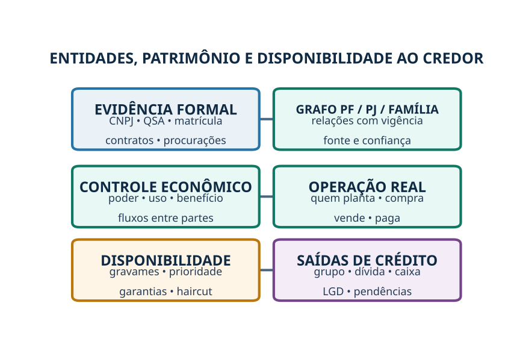

### 4.1 Quatro visões que não podem ser confundidas

| Visão | Evidência | Pergunta de crédito |
|---|---|---|
| Titularidade formal | CNPJ, QSA, matrícula, contrato, registro | Em nome de quem está? |
| Controle econômico | Poder decisório, procuração, fluxo, uso e dependência | Quem controla e se beneficia? |
| Operação | Quem planta, compra, vende, emprega e movimenta caixa | Quem gera e consome recursos? |
| Disponibilidade ao credor | Gravame, garantia, prioridade, regime e haircut | O ativo ou caixa pode suportar a obrigação? |

A pulverização entre familiares não comprova evasão fiscal, blindagem ilícita ou indisponibilidade. Pode decorrer de sucessão, regimes familiares, organização operacional ou planejamento legítimo. A plataforma deverá produzir **complexidade e pendência de diligência**, não uma acusação. Se houver divergência entre forma e fluxo, o caso irá para revisão jurídica/tributária do credor.

### 4.2 Grafo mínimo

Os nós serão PF, PJ, família, fazenda, talhão, conta, dívida, CPR, contrato, derivativo, ativo, garantia, comprador, fornecedor, armazém, transportador e operação. Cada aresta terá `relationship_type`, vigência, fonte, evidência, confiança e percentual quando aplicável.

O grafo deve evitar dupla contagem de receita, dívida e patrimônio. Também deve localizar coobrigações, avais, garantias cruzadas, empréstimos intragrupo, cessões, arrendamentos e pagamentos de uma entidade em benefício de outra.

### 4.3 Saídas de governança patrimonial

| Saída | Interpretação correta |
|---|---|
| `unresolved_control_share` | Parte da estrutura ainda não explicada |
| `debt_reconciliation_gap` | Diferença entre fontes após tentativa de conciliação |
| `asset_legal_availability_ratio` | Parcela elegível e juridicamente disponível após haircut |
| `related_party_cashflow_ratio` | Dependência de fluxos entre partes relacionadas |
| `coobligation_exposure_ratio` | Exposição contingente segundo política ainda a definir |
| `structure_complexity` | Esforço e risco de consolidação; não culpa presumida |

---

## 5. Governança do produtor, gestão, equipe e tecnologia

A capacidade operacional deve entrar como módulo próprio. A Embrapa descreve gestão por talhões com custos, comparações entre safras/culturas e ponto de equilíbrio; o MAPA associa agricultura de precisão a otimização de insumos, redução de perdas, monitoramento e necessidade de qualificação.[52] [53] A plataforma, entretanto, não premiará a simples compra de tecnologia: medirá uso, cobertura, manutenção, integração, qualidade do dado e resposta gerencial.

### 5.1 Pilares e evidências

| Pilar | Evidência preferida | Métricas candidatas |
|---|---|---|
| Planejamento | Orçamento por talhão/cultura, calendário e revisão | Erro de custo e produtividade; tempestividade |
| Controle financeiro | Fechamento, conciliação bancária, estoque e posição | Atraso de fechamento; divergências; completude |
| Gestão agronômica | Caderno de campo, amostragem, laudos e assistência | Frequência, resposta e eficácia de controle |
| Comercial/hedge | Posição física e financeira por vencimento | Cobertura, limite, governança e reconciliação |
| Pessoas | Organograma, formação, experiência e sucessão | Cobertura de funções e key-person risk |
| Tecnologia | ERP/FMIS, telemetria, mapas, integrações e logs | Uptime, uso efetivo, calibração e cobertura |
| Continuidade | Seguro, backup, peças, energia e fornecedores | Horas de autonomia e tempo de recuperação |

Questionário autodeclarado não será suficiente para uma feature decisória. Cada resposta deverá ter `evidence_id`, fonte, responsável, validação, `available_time` e validade. Na primeira etapa, esses atributos formarão subscore, confidence score e reason codes; sua entrada direta na PD dependerá de estabilidade e validação fora da amostra.

### 5.2 Governança mínima da operação

A avaliação deverá observar segregação entre autorização, contratação, pagamento, conciliação e decisão de hedge. Também verificará limites por contraparte, política de retirada/distribuição, registro de exceções, plano de sucessão e reunião periódica de caixa e posição.

A ausência de formalização em um produtor menor não deve ser confundida automaticamente com má gestão. O produto deverá medir **capacidade proporcional à complexidade e à exposição**, oferecendo uma trilha de melhoria em vez de penalizar apenas a forma.

### 5.3 Máquinas, equipamentos e softwares produtivos

A avaliação deverá inventariar tratores, plantadeiras/semeadoras, distribuidores, pulverizadores, colheitadeiras, plataformas, transporte interno, caminhões, secadores, silos, irrigação, bombas, geração/backup, sensores, GNSS/RTK, drones, telemetria, conectividade, ERP, FMIS e sistemas de manutenção, estoque, comercialização e hedge. A Embrapa trata agricultura de precisão como processo gerencial que usa variabilidade espacial, máquinas, sensores, IoT, telemetria, redes e software; estudos publicados pela instituição apontam potencial econômico, mas as estimativas não devem ser transferidas como ganho garantido para um produtor específico.[69] [70] [71]

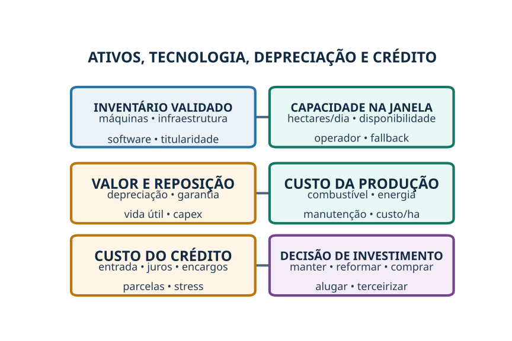

| Dimensão | Pergunta de crédito | Evidência |
|---|---|---|
| Adequação | A máquina atende área, solo, cultura e operação? | Especificação, teste e histórico |
| Janela | Conclui plantio, manejo e colheita no prazo? | Hectares/dia, horas disponíveis e paradas |
| Utilização | O ativo possui escala ou está ocioso? | Horímetro, telemetria e área atendida |
| Confiabilidade | Qual falha, manutenção e tempo de reparo? | Ordens, peças, downtime e SLA |
| Pessoas | Há operador qualificado e substituto? | Escala, treinamento e experiência |
| Integração | O dado vira decisão e reconcilia com operação? | Logs, mapas, ERP/FMIS e auditoria |
| Redundância | Há ativo ou serviço alternativo? | Contrato, fornecedor e tempo de resposta |
| Retorno | Reduz custo/perda ou aumenta receita de forma observável? | Antes/depois, talhão comparável e fluxo incremental |

A capacidade será estimada por operação: `horas requeridas = área ÷ capacidade de campo efetiva`; `horas disponíveis = horas trabalháveis × disponibilidade mecânica × disponibilidade de operador`. Catálogo de fabricante será fallback; a medida preferida é observada na operação.

### 5.4 Custo da máquina na própria produção

A metodologia de custos da CONAB distingue custos variáveis, custos fixos, despesas financeiras, depreciação, manutenção, seguro e remuneração do capital. Para máquina própria, considera tipo, modelo, potência, intensidade, horas por hectare, combustível/energia, operador, vida útil, valor residual e manutenção.[72] O motor preservará essa separação:

`custo/ha = combustível + energia + operador + consumíveis + manutenção + seguro + depreciação econômica + custo do capital`, todos alocados por uso.

Ativo moderno pode piorar a margem se estiver subutilizado, superdimensionado, excessivamente financiado ou sem operador/manutenção. Ativo antigo pode manter boa capacidade se confiável e economicamente mantido; idade isolada não será reason code adverso.

### 5.5 Depreciação, valor de garantia e reposição

Depreciação contábil/fiscal, perda econômica, obsolescência tecnológica e valor realizável de garantia serão medidas diferentes. O Censo Agropecuário oferece benchmark estrutural sobre máquinas, veículos, energia, silos, combustíveis, investimentos, financiamentos e valor dos bens, mas possui recorte agregado e data de referência; não substitui inventário atual.[73]

| Medida | Uso |
|---|---|
| Depreciação contábil | Reconciliação com demonstrações e tributos |
| Depreciação econômica | Custo real por idade, horas, condição e mercado |
| Obsolescência | Suporte, peças, eficiência, software e integração |
| Valor de garantia | Valor realizável líquido, gravame, prazo e haircut |
| Capex de reposição | Saída de caixa necessária para manter a capacidade |

A análise produzirá `replacement_capex_12m`, `replacement_capex_36m`, manutenção atrasada, vida útil remanescente, reserva de reposição e ativos críticos sem alternativa. **Depreciação é custo econômico; reposição é caixa futuro.** As duas serão reconciliadas, não confundidas.

### 5.6 Custo do crédito de investimento e de custeio

Financiamento de máquina terá preço all-in, entrada, instalação, treinamento, valor liberado, indexador, juros, spread, taxas, seguro, garantia, carência, amortização, balão, moeda e valor residual. O BNDES Finame Agrícola ilustra que o custo de uma linha pode combinar custo financeiro, taxa do BNDES e taxa do agente, com prazo e participação variáveis.[74]

O custo efetivo será calculado pelo fluxo completo, seguindo a disciplina econômica do CET: valor solicitado, financiado e liberado; tarifas, tributos, seguro, outros encargos e todas as parcelas. A aplicabilidade regulatória do CET a cada instrumento será validada por compliance.[75] [76]

Para o **custeio da safra**, a mesma lógica abrangerá desembolsos por data, juros, indexadores, barter, CPR, prazo de fornecedor, garantias e custo de oportunidade. Serão calculados `all_in_effective_cost`, `total_cash_paid`, `present_value_cost`, serviço por janela e custo de refinanciamento sob stress.

A decisão de adquirir equipamento será comparada a manter, reformar, alugar, terceirizar ou compartilhar, por VPL incremental, DSCR do investimento, utilização de equilíbrio, custo evitado e valor de redundância. Ganho de produtividade não comprovado permanecerá em cenário, não no caso-base.

---

## 6. Motor financeiro: receita, custo, overhead, dívida, caixa e limite

O motor financeiro será o núcleo da capacidade de pagamento. A análise patrimonial complementa, mas não substitui a demonstração de que a operação gera caixa nas datas corretas.

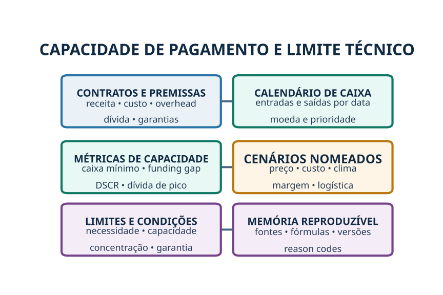

### 6.1 Receita validada

A receita será reconstruída por cultura e contrato, com quantidade, qualidade, preço ou fórmula, praça, moeda, contraparte, recebimento, obrigação de entrega e status. O volume não contratado será valorizado por cenário, não como recebível certo.

`net_sales` permanece uma definição a ser confirmada pelo dono do produto. Até essa definição, a plataforma deverá preservar o nome original e manter uma ponte visível entre receita bruta física, descontos, impostos, fretes, qualidade e receita líquida para crédito.

### 6.2 Custos e compras abertas

Custos devem ser separados entre orçamento, contratado, entregue, faturado e pago. Fertilizantes, defensivos, sementes, diesel, serviços e fretes serão associados a quantidade, unidade, moeda, fornecedor, data e talhão/cultura quando possível.

O risco de preço de insumo incide sobre a **parcela ainda aberta**, não sobre todo o orçamento. Uma alta do dólar, por exemplo, pode beneficiar soja não fixada em reais e encarecer fertilizantes não comprados. O efeito líquido depende das exposições simultâneas.

### 6.3 Dívida consolidada e serviço por data

O saldo total é insuficiente. Cada instrumento terá credor, devedor, coobrigado, principal, juros, indexador, moeda, cronograma, finalidade, prioridade, garantia, covenant, atraso e fonte. SCR, CACR, Open Finance e documentos do cliente devem ser reconciliados; o Banco Central descreve o SCR como sistema de registro de operações de crédito e o compartilhamento de dados rurais depende das autorizações e condições aplicáveis.[1] [3] [8]

O escopo incluirá dívida bancária, fornecedores, barter, CPR física/financeira, arrendamento, recebíveis cedidos com coobrigação, derivativos, tributos parcelados, contingências materiais e empréstimos intragrupo. O tratamento numérico de coobrigações é decisão de política; até aprovação, o sistema mostrará valores brutos, cenários e status, sem peso implícito.

### 6.4 Fluxo de caixa temporal

O calendário será semanal nos períodos críticos e mensal nos demais; derivativos poderão exigir grade diária. Cada fluxo terá entidade, contrato, moeda, data contratual, data esperada, prioridade, confiança e cenário.

| Indicador | Por que é melhor que uma fotografia anual |
|---|---|
| Caixa mínimo | Mostra o pior ponto da trajetória |
| Dias de caixa negativo | Mede duração do aperto |
| Funding gap máximo | Dimensiona liquidez adicional necessária |
| DSCR por janela | Alinha caixa ao serviço contratual |
| Dívida de pico | Captura sazonalidade de custeio |
| Concentração de vencimentos | Identifica cliffs de liquidez |
| Distância a covenant | Permite ação antes da quebra |

### 6.5 Limite técnico

O limite não sairá diretamente da PD. Ele será o menor valor consistente com necessidade elegível, capacidade base, capacidade sob stress, concentração do credor, garantias, políticas e funding gap controlável.

```text
Limite técnico
= mínimo entre
  necessidade comprovada,
  capacidade de serviço,
  caixa suportado sob cenários,
  limite por concentração,
  limite por garantia/política
```

Preço, prazo, covenants e condições permanecerão decisões do credor, com alçada e override registrados.

---

## 7. Mercado, contratos físicos, futuros, opções, dólar e margem

Cotações B3 e CME, PTAX/SGS e referências físicas podem alimentar o motor, respeitando especificações de contrato, unidades, horários, calendários e licenciamento.[22] [33] [34] [35] [36] Dados em tempo real de bolsa tendem a exigir contratação/licença; não se deve desenhar o produto supondo feed gratuito ou direito de redistribuição.

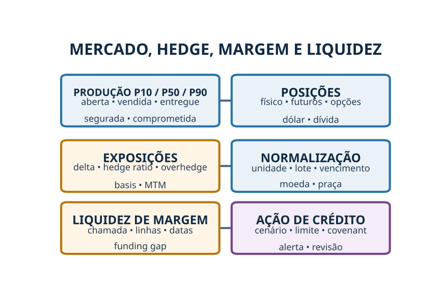

### 7.1 Posição econômica consolidada

| Camada | Conteúdo |
|---|---|
| Produção | P10/P50/P90, realizada, segurada e disponível |
| Venda física | Quantidade, preço/fórmula, basis, moeda, qualidade, praça e vencimento |
| Futuros | Bolsa, contrato, vencimento, lado, lote, preço e ajuste |
| Opções | Tipo, strike, prêmio, vencimento, quantidade e delta |
| Câmbio | Receita, custo, dívida, NDF/futuro/opção e vencimento |
| Financiamento | Linhas para margem, limites, garantias e custo |

Todas as posições serão convertidas para unidade canônica, preservando o contrato original. A plataforma calculará volume aberto, exposição delta, hedge ratio por P50, overhedge por P10, basis regional, valor marcado a mercado, chamada de margem sob stress e descasamento entre liquidação financeira e recebimento físico.

### 7.2 Efeitos assimétricos de preço

A alta da soja não é universalmente positiva. Ela pode aumentar receita do volume aberto, mas provocar chamada de margem para posição futura vendida. A queda pode reduzir receita aberta, mas gerar ajuste positivo no futuro vendido. Uma quebra de produtividade pode transformar proteção razoável sobre P50 em obrigação superior à produção P10.

> O modelo deverá explicar a posição, e não apenas informar que “preço e default têm correlação”.

Exemplo de reason code desejado: “A soja subiu 12%; a posição vendida equivale a 82% da produção P50 e 121% da P10; a chamada de margem estimada em cinco dias supera caixa elegível e linha disponível antes do recebimento físico.”

### 7.3 Correlação como descoberta, não como atalho

Serão analisadas relações contemporâneas, defasadas, móveis, não lineares e condicionais. Séries de preço, câmbio e juros deverão ser transformadas adequadamente; níveis não estacionários não entrarão mecanicamente em regressões. As variáveis candidatas incluem retorno, volatilidade, basis, inclinação da curva, carry, volume, open interest, volatilidade implícita e quebra de regime.

Uma correlação só avança para produção quando possui mecanismo econômico, disponibilidade point-in-time, sinal estável, ganho fora da amostra, ausência de vazamento e reason code compreensível. A própria literatura recente mostra que a exposição geopolítica e a reação de mercado variam por setor; medidas de percepção empresarial e de mercado são complementares, não intercambiáveis.[65]

### 7.4 Derivativos e suitability

O produto de crédito poderá **medir** exposição e liquidez de derivativos, mas não recomendar operações especulativas. Suitability, intermediação, registro, margem e tratamento contratual/contábil pertencem a regimes próprios e devem ser revisados por especialistas; a Resolução CVM nº 30 é uma referência para adequação de produtos no âmbito em que se aplica.[49]

---

## 8. Agronomia, clima, solo, pragas e novidade

As fontes iniciais incluem IBGE e CONAB para produção, IMEA para contexto de Mato Grosso, ZARC para janelas e classes de risco, INMET para estações, CHIRPS e ERA5-Land para grades, PronaSolos/SoilGrids para solo, MapBiomas/INPE para uso e mudanças e Embrapa/AGROFIT para manejo e produtos fitossanitários.[10] [12] [13] [14] [15] [16] [17] [18] [19] [20] [21] [42] [43]

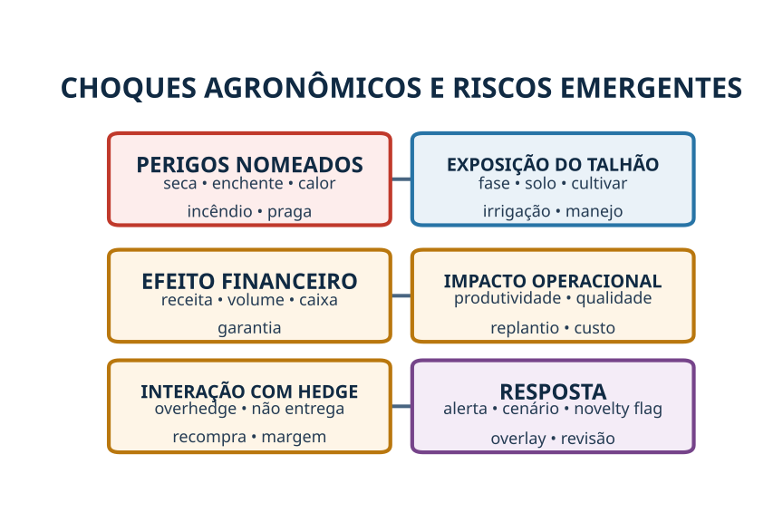

### 8.1 Modelo de produtividade

O baseline deve produzir distribuição P10/P50/P90 por talhão ou unidade operacional, combinando histórico próprio validado, região, solo, cultivar/ciclo quando disponível, plantio, clima realizado e sinais remotos. A qualidade da previsão deve ser acompanhada por fase fenológica e antecedência.

O modelo não deve confundir choque com exposição. Seca só altera produtividade conforme fase, intensidade, solo, cultivar, irrigação e manejo; chuva só interrompe escoamento quando intersecta talhão, acesso, armazém ou rota.

### 8.2 Pragas e doenças

A camada de sanidade será criada do zero. Ela deverá registrar espécie/doença, área, severidade, amostragem, fase, aplicação, dose, custo, resistência, eficácia e data. Alertas regionais geram investigação; não provam ocorrência no imóvel.

### 8.3 Eventos nomeados

A biblioteca inicial incluirá seca em floração/enchimento, calor extremo, excesso de chuva na colheita, enchente, incêndio, granizo, replantio, praga/doença, falha de controle e risco emergente. Cada cenário especificará janela, geografia, mecanismo, variáveis afetadas, correlação com outros choques e evidência de encerramento.

### 8.4 Eventos fora da amostra

Eventos novos não serão forçados ao padrão histórico. Um `novelty_flag` será acionado quando a combinação estiver fora do suporte do treinamento, a fonte for inédita ou o mecanismo não estiver coberto. A resposta será faixa de impacto, overlay temporário, revisão humana e plano de coleta, não extrapolação precisa.

Fontes globais como GDACS, Copernicus EMS e NASA Earthdata podem identificar desastres e geometrias em tempo próximo do real; um alerta continua sendo perigo/impacto potencial, não prova de dano individual.[60] [61] [62] [63]

---

## 9. Logística multimodal, armazenagem, combustível e energia

A soja de Mato Grosso será modelada por um grafo que liga fazenda/talhão, armazém, terminal, esmagadora, comprador e porto por segmentos rodoviários, ferroviários, hidroviários e transbordos. ANTT, DNIT e ONTL/Infra S.A. disponibilizam dados de cargas, ferrovias, rodovias, pavimento, tráfego, infraestrutura e planejamento; a CONAB mantém informações de unidades armazenadoras.[54] [55] [56] [57]

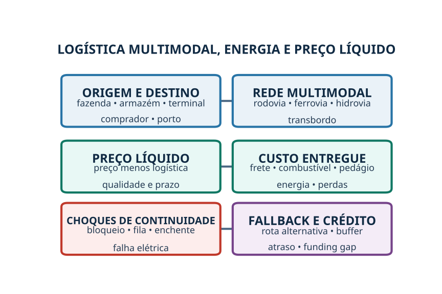

### 9.1 Custos de escoamento

O custo precisa distinguir frota própria, frete contratado e benchmark. Distância geodésica não basta; a rota deverá usar rede operacional, pedágios, condição, restrição, tempo, sazonalidade, transbordo e destino.

`preço líquido na fazenda = preço de venda − frete − armazenagem − secagem − transbordo − descontos de qualidade − perdas − custo financeiro do prazo`.

| Variável | Evidência preferida | Fallback |
|---|---|---|
| Distância/rota | Contrato + origem/destino + rede válida | Rede oficial e rota estimada sinalizada |
| Frete | Contrato, CT-e e pagamento | Benchmark regional com baixa confiança |
| Armazenagem | Contrato, capacidade disponível e tarifa | Cadastro de unidade; não presumir vaga |
| Tempo/fila | Histórico próprio e operador | Sazonalidade regional |
| Interrupção | Evento georreferenciado e trecho | Alerta sem confirmação operacional |

### 9.2 Redundância e continuidade

A análise calculará confiabilidade da rota, custo e prazo de alternativa, concentração por corredor, dias de buffer de armazenagem e pontos únicos de falha. Um bloqueio distante só afeta o produtor se houver interseção com a rede utilizada.

### 9.3 Combustível

A ANP publica levantamentos semanais com recortes geográficos e dados por posto; isso serve como benchmark, deflator e cenário.[40] O custo real do produtor virá de NF-e, contrato, estoque, consumo e eficiência de frota/máquinas.

### 9.4 Energia elétrica e geração própria

A ANEEL oferece base de tarifas, enquanto o WEBMAP da EPE permite mapear geração, transmissão, subestações, biocombustíveis e infraestrutura de combustíveis.[58] [59] A fatura efetiva depende de modalidade, demanda, tributos, bandeiras, contratos e geração própria.

Serão avaliados kWh/tonelada na secagem, kWh/ha na irrigação, litros/ha, energia de armazenagem, interrupções, autonomia de backup, manutenção e disponibilidade de combustível. Infraestrutura planejada não será tratada como existente ou disponível.

---

## 10. Geopolítica, comércio, sanções, notícias e redes sociais

O **risco geopolítico** será modelado por sua transmissão a insumos, compradores, países, moedas, rotas, preços, volatilidade e liquidez. O módulo geopolítico será um radar de **propagação de choque**, não um score abstrato. O GPR de Caldara e Iacoviello oferece séries de ameaças e atos geopolíticos; o GDELT estrutura eventos, entidades, locais e tom em notícias globais; a ONU mantém lista consolidada de sanções em formatos estruturados.[64] [66] [67]

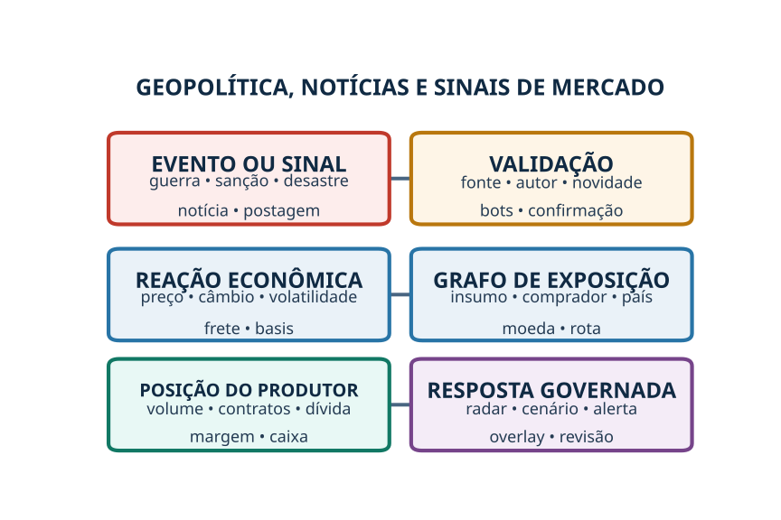

### 10.1 Grafo de exposição global

| Evento | Exposição necessária | Canal econômico |
|---|---|---|
| Guerra/sanção | País de fornecedor, comprador, moeda ou rota | Oferta, demanda, pagamento, câmbio e frete |
| Tarifa/restrição | Produto e destino/origem comercial | Paridade, basis e fluxo comercial |
| Desastre exterior | Região produtora, porto, fornecedor ou comprador | Preço, prazo, disponibilidade e substituição |
| Crise energética | Petróleo, gás, fertilizante, eletricidade ou modal | Custo de insumo e transporte |
| Postagem/notícia | Entidade/tema relevante e reação observável | Expectativa, preço, volatilidade e margem |

Uma enchente no Nepal, por exemplo, entra no radar global porque GDACS/Copernicus registram evento e geografia. Ela só altera cenário da soja de Mato Grosso se houver caminho demonstrável: fornecedor, comprador, rota, produto substituto, energia, seguro ou reação de mercado pertinente.

### 10.2 Sinais do X/Twitter

Uma postagem pode mover preço, mas volume social não é verdade. O sistema deverá guardar post, autor, timestamp, métricas, entidades, tema, alcance, deduplicação e licença; avaliar bots, spoofing, rumor e conteúdo antigo; buscar confirmação independente; e observar reação de preço, volume, volatilidade e basis.

O acesso a posts públicos deve usar API e condições contratuais aplicáveis, sem pressupor histórico, retenção ou redistribuição ilimitados.[68] Uma postagem isolada não poderá reprovar produtor ou elevar PD individual. Ela poderá acionar alerta de mercado e recalcular margem/caixa quando houver exposição confirmada.

### 10.3 Sanções e compliance

Listas oficiais devem alimentar motor de regras separado do modelo estatístico. Correspondência por nome não basta: a decisão exige identificadores, regime, data, jurisdição, revisão e tratamento de homônimos. Esse processo não pode ser confundido com inferência de risco de crédito.

---

## 11. Fontes de dados, frequência, licença e fallback

O catálogo detalhado está em `matriz_fontes_v3.csv`. Cada fonte deverá ser contratada e governada por finalidade, cobertura, granularidade, latência, histórico, revisão, licença, retenção, redistribuição, custo e plano de continuidade.

| Nível | Fonte | Uso principal |
|---|---|---|
| P0 — decisório | Histórico do credor, contratos, extratos, contabilidade, SCR/CACR consentidos, documentos de garantia e regras | Identidade, dívida, caixa, rótulo e elegibilidade |
| P1 — enriquecimento crítico | Produção, clima, solo, preços físicos, mercado, logística, energia e operação | Cenários, produtividade, preço líquido e monitoramento |
| P2 — radar | Eventos globais, notícias, geopolítica e redes sociais | Descoberta, alerta, stress e novidade |

A hierarquia será **dado específico validado do produtor/contrato → fonte externa específica → benchmark regional → fallback explicitamente sinalizado**. O preenchimento não poderá ocultar ausência de dado.

### 11.1 Contrato de dados

Cada tabela ou feed terá owner, schema, unidade, chave, frequência, SLA, timezone, calendário, regras de qualidade, versão e política de correção. Para market data, serão preservados símbolo, bolsa, contrato, vencimento, moeda, lote, horário e condição de negociação.

### 11.2 Fallback e confiança

Quando uma fonte falhar, a plataforma deverá reduzir confiança, usar último valor válido dentro de prazo, benchmark ou intervalo de cenário conforme regra aprovada. Não haverá extrapolação silenciosa. Features críticas ausentes podem bloquear decisão ou exigir revisão.

### 11.3 Licenças

B3, CME, X/Twitter, provedores físicos e dados comerciais precisam de análise de licença antes de armazenar, redistribuir ou exibir. O desenho econômico deve separar custo de feed, custo por consulta, direitos de histórico e direitos de uso em modelos.

---

## 12. Arquitetura temporal de dados e motores

A feature store temporal garantirá que originação use apenas o que estava disponível na decisão. Monitoramento poderá usar fatos posteriores, sem reescrever o dossiê original.

| Timestamp | Significado |
|---|---|
| `event_time` | Quando o fato ocorreu no mundo |
| `available_time` | Quando a organização poderia conhecê-lo legitimamente |
| `ingested_time` | Quando entrou na plataforma |
| `effective_from/to` | Vigência jurídica, contratual ou cadastral |
| `decision_time` | Corte da fotografia de crédito |

O valor revisado de IBGE, CONAB, preço, clima, contrato ou cadastro não substituirá o valor que sustentou uma decisão passada. A decisão armazenará `source_version`, `model_version`, `rule_version`, `feature_snapshot_id` e hash das evidências.

### 12.1 Separação entre dados e regras

| Categoria | Exemplo | Comportamento |
|---|---|---|
| Fato | Saldo, chuva, preço, contrato, proprietário | Versionado; sujeito a qualidade |
| Regra legal/regulatória | Impedimento, requisito, proteção de dados | Aplicação determinística com vigência e revisão jurídica |
| Regra contratual | Covenant, obrigação, garantia e vencimento | Específica da operação/contrato |
| Política do credor | Corte, limite, concentração e alçada | Configurável e versionada por cliente |
| Feature preditiva | DSCR, volatilidade, desvio vegetativo | Calculada e validada |
| Overlay | Ajuste temporário por evento emergente | Prazo, responsável e critério de saída |

### 12.2 Motores

A plataforma combinará resolução de grupo, regras, caixa, produtividade, mercado/hedge, logística/energia, PD, LGD, EAD, early warning, novidade e risco de carteira. Regras impeditivas não devem ser diluídas em score. Confiança de dados não deve ser confundida com risco econômico.

---

## 13. Correlações, interações e causalidade econômica

A análise ampla de correlações é recomendada para descoberta, desde que organizada em hipóteses. O objetivo é localizar sinais que antecedem deterioração e medir interações entre preço, custo, clima, posição, dívida e liquidez.

### 13.1 Matriz causal

O anexo `matriz_causal_v3.csv` descreve choque, exposição condicionante, mediador, efeito financeiro, desfecho, defasagens e placebo. Esse desenho evita conclusões como “a soja subiu, portanto o risco aumentou”. A conclusão correta poderá ser: “a soja subiu, a posição vendida exigiu margem, a produção P10 não cobre a obrigação e o recebimento físico ocorre depois da liquidação financeira”.

### 13.2 Métodos

| Problema | Método recomendado | Cuidado |
|---|---|---|
| Relação simples | Pearson/Spearman, mutual information e gráficos | Não confundir associação com causalidade |
| Defasagem | Cross-correlation e distributed lags | Evitar look-ahead e datas desalinhadas |
| Séries de mercado | Retornos, diferenças, volatilidade e cointegração quando cabível | Não regredir níveis espúrios |
| Regime | Rolling windows, change points e modelos de regime | Estimar com dados anteriores ao corte |
| Evento | Event study e diferença de exposição | Definir janela e grupo comparável |
| Tempo até distress | Survival/hazard com covariáveis temporais | Censura e múltiplos eventos |
| Interações | GAM, árvores/boosting restrito e termos econômicos | Estabilidade, monotonicidade e explicação |
| Choques conjuntos | Cenários condicionais; depois cópulas/fatores | Não somar extremos impossíveis |

### 13.3 Gates de promoção de feature

Uma variável passa de pesquisa para produção somente quando possui cobertura suficiente, mecanismo econômico documentado, timestamp confiável, sinal estável entre safras, ganho incremental fora da amostra, ausência de vazamento, tolerância a missing e explicação operacional.

A busca por “todos os números correlacionados” continuará no ambiente de pesquisa, com controle de múltiplos testes e registro de hipóteses. O modelo de produção usará conjunto menor e governado para reduzir falso positivo e overfitting.

---

## 14. Rótulos, coortes e modelos

### 14.1 Rótulos

O rótulo primário deve ser definido pelo contrato do credor: inadimplência material/default dentro de uma janela após a decisão. Rótulos auxiliares incluirão atraso, renegociação, concessão, recuperação judicial, execução, não entrega, fraude confirmada, chamada de margem, quebra agronômica e pagamento tempestivo.

A entrada em recuperação judicial é um desfecho importante, mas não deve ser tratada como sinônimo de uma única causa. Estudos de evento e survival poderão analisar 30, 60, 90 e 180 dias antes do evento, controlando dívida, governança, produtividade, mercado, vencimentos e liquidez.

### 14.2 Coorte

Haverá uma linha por decisão/operação, com corte temporal explícito. Reprovados sem performance não terão rótulo de bom ou mau. Renovações do mesmo grupo permanecerão ligadas, mas o treino/teste deve impedir memorização por grupo, fazenda ou operação.

### 14.3 Escada de modelos

| Estágio | Modelo | Condição de uso |
|---|---|---|
| 1 | Regras + caixa + cenários | Imediato, com validação de negócio |
| 2 | Scorecard/logística regularizada | Amostra e rótulo minimamente estáveis |
| 3 | Challenger de boosting com restrições | Ganho fora da amostra e reason codes |
| 4 | Survival/PD temporal e EWS | Histórico longitudinal suficiente |
| 5 | LGD/EAD e simulação conjunta | Recuperações e exposições confiáveis |
| 6 | Grafo/contágio e carteira | Rede e portfólio maduros |

### 14.4 Métricas

Discriminação será acompanhada por AUC/Gini e precision-recall; calibração por Brier, curvas e erro por faixa; decisão por aprovação, bad rate, perda esperada e valor econômico; estabilidade por PSI/drift, safra, região, porte e canal. Cenários serão avaliados por cobertura, erro de produtividade, erro de caixa e capacidade de antecipar alertas acionáveis.

### 14.5 Validação independente

A validação deverá revisar conceito, dados, amostra, feature store temporal, fórmulas, implementação, performance, estabilidade, sensibilidade, cenários, uso e limites. O guia SR 11-7, os princípios BCBS 239 e o NIST AI RMF oferecem referências úteis de risco de modelo, agregação de dados e governança de IA, adaptadas ao contexto brasileiro.[29] [30] [31]

---

## 15. LGPD, explicabilidade, contestação e governança decisória

A LGPD exige finalidade, necessidade, segurança, transparência e direitos aplicáveis; decisões automatizadas e dados usados para crédito exigem governança específica e orientação jurídica.[32] Cadastro Positivo e fontes consentidas possuem regras próprias.[9]

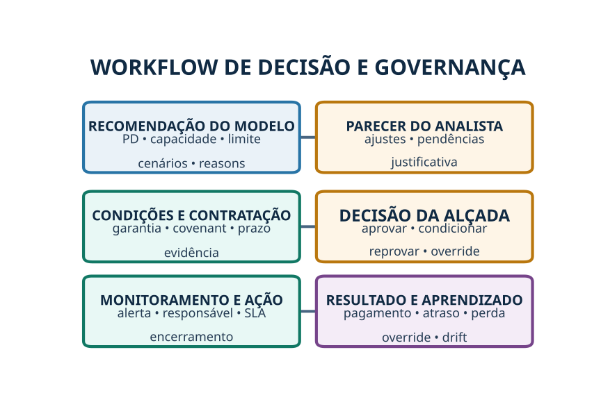

### 15.1 Governança organizacional

| Papel | Responsabilidade |
|---|---|
| Dono do produto | Define usuário, decisão, política e valor |
| Crédito | Aprova conceitos, cenários, reason codes e ações |
| Data owner | Responde por fonte, qualidade e permissão |
| Model owner | Desenvolve, documenta e monitora |
| Validação independente | Desafia dados, método, performance e uso |
| Jurídico/compliance | Valida normas, contratos, LGPD, sanções e garantias |
| Agronomia | Valida mecanismos de cultura, clima, solo e pragas |
| Mercado/tesouraria | Valida posição, derivativos, margem e liquidez |
| Operações | Executa pendências, condições e monitoramento |
| Comitê/alçada | Decide e responde por overrides |

### 15.2 Explicabilidade

Cada saída deverá mostrar fatos determinantes, cenários, regras, ausências e confiança. A explicação deve ser causalmente coerente e acionável: completar documento, ajustar prazo, reduzir volume, exigir liquidez de margem, diversificar comprador, reforçar garantia ou monitorar talhão.

### 15.3 Contestação

O produtor/cliente deve poder identificar o dado utilizado, sua fonte e data; apresentar correção; e receber reprocessamento versionado quando cabível. Correção atual não apaga a decisão histórica.

### 15.4 Overrides

Override terá motivo padronizado, texto, aprovador, alçada, validade e resultado posterior. Taxas de override por motivo, segmento e aprovador entrarão no monitoramento de política e modelo.

---

## 16. Roadmap de implementação

O roadmap proposto cobre **18 meses**, com gates que impedem avançar apenas pelo calendário.

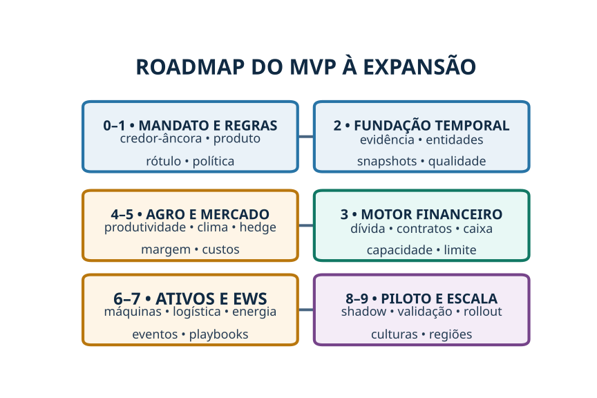

| Fase | Prazo indicativo | Entregáveis | Gate de saída |
|---|---:|---|---|
| 0. Mandato e piloto | Semanas 0–4 | Credor-âncora, produto, rótulo, governança, acesso e casos | Contrato de dados e decisão-alvo aprovados |
| 1. Taxonomia e regras | Semanas 3–8 | Dicionário, entidades, política, regras e pauta do owner | Definições críticas aprovadas |
| 2. Fundação temporal | Meses 2–4 | Evidência, event store, entidades, snapshots e QA | Reprodução point-in-time demonstrada |
| 3. Baseline financeiro | Meses 3–6 | Caixa, dívida, CPR, capacidade, limite e comparador legado | Reconciliação e UAT de Crédito |
| 4. Agro e territorial | Meses 4–8 | Produtividade, clima, solo, satélite, pragas e cenários | Backtest por safra e revisão agronômica |
| 5. Mercado/hedge | Meses 5–9 | Posições, basis, MTM, margem, câmbio e custos abertos | Reconciliação diária e testes de stress |
| 6. Ativos/logística/energia | Meses 7–11 | Inventário, capacidade, depreciação, reposição, crédito de investimento, grafo multimodal e energia | Custos, ativos críticos, rotas e capex reconciliados em casos reais |
| 7. EWS e geopolítica | Meses 9–13 | Eventos, notícias, exposição, novelty e playbooks | Precisão de alerta e SLA operacional |
| 8. Shadow e piloto | Meses 10–15 | Score baseline/challenger, dashboard, overrides e monitoramento | Performance e governança aprovadas |
| 9. Escala | Meses 15–18+ | Nova região/cultura, portfólio, LGD/EAD e automação controlada | Validação externa/temporal e operação estável |

### 16.1 Equipe mínima

| Função | Dedicação indicativa no MVP |
|---|---:|
| Product owner de crédito agro | 1,0 |
| Especialista de crédito agro | 1,0–2,0 |
| Cientista de dados/risco | 1,0–2,0 |
| Engenheiro de dados/geoespacial | 1,0–2,0 |
| Engenheiro de software/MLOps | 1,0–2,0 |
| Agrônomo | 0,5–1,0 |
| Especialista de mercado/derivativos | 0,3–0,5 |
| Jurídico/compliance/LGPD | 0,2–0,5 |
| Validação independente | 0,3–0,5 |
| UX/BI para analistas | 0,3–0,5 |

### 16.2 Priorização econômica

O orçamento deve separar pessoas, dados/licenças, infraestrutura, geoprocessamento, validação e integração do credor. A maior incerteza tende a estar em qualidade/histórico do credor, dados consentidos, market data, documentos e integração operacional — não no algoritmo isolado.

### 16.3 Estratégia de implantação

No shadow mode, o sistema não altera decisões; compara saídas com o processo atual e captura divergências. No piloto, decisões continuam assistidas. Automação parcial só será permitida para tarefas repetitivas e regras de baixa ambiguidade, com amostragem e rollback.

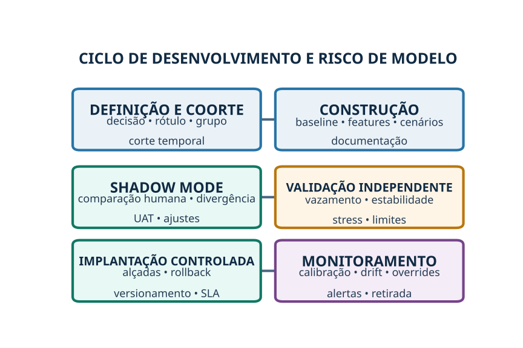

---

## 17. Pauta contextualizada para o dono do produto

As perguntas abaixo não impedem o desenho da arquitetura, mas impedem transformar ambiguidade em regra automática.

| Tema | Contexto observado | Decisão que o dono do produto deve tomar | Consequência técnica |
|---|---|---|---|
| Versão mestre | Três arquivos do mesmo produtor possuem sobreposição e diferenças | Qual é autoritativo? Se nenhum, qual artefato tem cada função? | Linhagem, QA e comparação correta |
| Produto-alvo | Há referência a prepay em moeda estrangeira lastreado por CPR física | É específico do caso ou produto-padrão? | Escopo, moeda, cultura, garantia e rótulo |
| `net_sales` | O termo aparece sem ponte inequívoca | Receita agrícola aceita, receita após descontos ou receita contábil líquida? | Fórmula de margem e comparabilidade |
| Overhead | Percentual de 30% é proxy de crédito | Quando usar; quais contas substituem; quais itens evitar duplicar? | Geração de caixa e reason code |
| Rótulo | Não há definição contratual única registrada | O que é default e qual janela? Como tratar renegociação/RJ? | Treino, validação e métricas |
| Parecer final | `Preliminary decision` não contém decisão; “avança condicionado” aparece em texto | Qual registro é mestre; quais status e alçadas? | Workflow, override e auditoria |
| Gates | Indicadores existem, mas cortes oficiais não estão confirmados | Limites de DSCR, alavancagem, liquidez, CPR e exceções | Política configurável; não inventar thresholds |
| Serviço da dívida | Há proxy de juros + principal de curto prazo | Incluir cronograma completo, barter, fornecedores, arrendamentos e derivativos? | Caixa e capacidade reais |
| Coobrigações | Tratamento econômico não está aprovado | Integral, ponderado, cenário ou alerta? | Dívida consolidada e EAD |
| Grupo PF/PJ | Patrimônio e operação podem estar pulverizados | Critérios de controle, consolidação, disponibilidade e documentação | Grafo e regra de diligência |
| Patrimônio | Titularidade não garante acesso do credor | Quais ativos, haircuts, gravames e regimes são elegíveis? | LGD e limite |
| Retiradas familiares | Podem ocorrer em PF/PJ distintos | O que é retirada normalizada e o que é despesa operacional? | Caixa disponível |
| Gestão | Novos pilares incluem equipe e tecnologia | Entram como veto, subscore, overlay ou apenas reason code? | Governança e necessidade de amostra |
| Máquinas e capacidade | Posse não comprova adequação ou produtividade | Quais operações, janelas e margens de capacidade são mínimas? Como tratar terceirização? | Inventário, capacidade e alertas |
| Depreciação | Contábil, econômica, obsolescência e garantia diferem | Qual método e fonte serão aceitos por classe de ativo? | Custo/ha, LGD e comparabilidade |
| Reposição | Ativo crítico pode exigir capex durante o horizonte do crédito | Quais gatilhos, horizontes e reservas entram no caso-base e no stress? | Fluxo de caixa e dívida futura |
| Crédito de investimento | Taxa nominal não representa custo all-in | Quais encargos, indexadores, moeda, carência e balão devem compor o custo? | VPL, DSCR e capacidade |
| Custeio | Barter, CPR, fornecedor e banco têm fluxos diferentes | Como equalizar preço, prazo, garantias e encargos? | Margem e escolha de funding |
| Market data | Tempo real possui custo e licença | Qual latência é necessária por usuário/produto? | Arquitetura e orçamento de dados |
| Derivativos | Posição pode proteger preço e gerar margem | Quais instrumentos e bolsas entram; quem valida posição? | Motor de payoff, margem e suitability |
| Logística | Rota, frete e armazenagem alteram preço líquido | Usar contrato, CT-e, benchmark e qual política de fallback? | Grafo e cenários de interrupção |
| Energia | Diesel e eletricidade afetam custo e continuidade | Quais processos críticos e evidências serão coletados? | Features de custo e resiliência |
| Eventos globais | Sinais podem ser ruidosos e distantes | Quais exposições e níveis acionam alerta/revisão? | Grafo de propagação e SLA |
| Redes sociais | Post pode mover preço, mas também ser rumor/manipulação | Fontes, autores, confirmação, retenção e ação permitida | Controles e risco reputacional |
| Novelty | Eventos inéditos não suportam previsão pontual | Quem aplica overlay, por quanto tempo e como encerra? | Governança de risco emergente |
| Override | Analista/alçada pode divergir do modelo | Motivos, aprovadores, validade e monitoramento | Aprendizagem e risco de modelo |
| Piloto | Benefício precisa ser mensurável | Redução de tempo, divergência, perda, alertas e adoção-alvo | Go/no-go e contrato comercial |

Enquanto essas decisões não forem aprovadas, o sistema exibirá `PENDING_POLICY` e intervalos/cenários. Não serão inseridos números “típicos” como se fossem política vigente.

---

## 18. Plano de trabalho dos primeiros 90 dias

### Dias 0–30: mandato, definições e dados

Formalizar credor-âncora, produto, unidade de decisão, rótulo, alçadas e autorização de dados. Selecionar 30–50 casos históricos completos, incluindo bons, atrasos, renegociações e casos difíceis. Classificar as três planilhas como legado, documentação e/ou requisitos depois da decisão do owner.

### Dias 31–60: reconstrução e protótipo

Implementar grafo mínimo de grupo, dívida por instrumento, contratos físicos, CPR, fluxo de caixa e snapshot temporal. Criar inventário-piloto de máquinas, implementos, infraestrutura e softwares, com capacidade por janela, manutenção, depreciação econômica, capex de reposição e financiamento. Reproduzir o caso-base e outros casos históricos, confrontando cada saída com o gerente. Criar biblioteca inicial de cenários nomeados e registro de decisão.

### Dias 61–90: shadow e priorização

Rodar o protótipo sem alterar decisões. Medir tempo, divergências, dados ausentes, overrides e alertas. Fechar contratos/licenças prioritários e decidir se mercado em tempo real é necessário no MVP ou se fechamento + intradiário sob evento atendem ao uso.

| Resultado em 90 dias | Evidência de conclusão |
|---|---|
| Dicionário aprovado | Definições assinadas por produto/crédito |
| Caso reproduzível | Snapshot, fontes, regras e fórmulas reexecutáveis |
| Grupo consolidado | Relações, dívidas, ativos e pendências visíveis |
| Inventário de ativos | Capacidade, uso, manutenção, depreciação, garantia e reposição reconciliados |
| Custo do crédito | Fluxo all-in de investimento e custeio por contrato e cenário |
| Caixa temporal | Entradas/saídas, capex e funding gap por cenário |
| Posição de mercado | Físico, hedge, moeda, basis e margem reconciliados |
| Cenários nomeados | Pelo menos seis choques com mecanismo e ação |
| Shadow report | Comparação com decisão humana e lacunas |

---

## 19. Riscos do programa e mitigação

| Risco | Impacto | Mitigação |
|---|---|---|
| Histórico pequeno/enviesado | PD instável | Começar por caixa/regras; coorte temporal; credor-âncora |
| Mistura PF/PJ | Dupla contagem e limite incorreto | Grafo, reconciliação e evidência |
| Planilha tratada como verdade | Legado vira política sem aprovação | Versão autoritativa e dicionário do owner |
| Dados futuros no treino | Performance artificial | Feature store temporal e testes de vazamento |
| Correlações espúrias | Falso sinal | Hipótese, múltiplos testes, out-of-time e placebo |
| Feed sem licença | Risco legal/comercial | Due diligence de dados e contrato |
| Evento social manipulável | Alertas errados | Deduplicação, credibilidade e confirmação de mercado |
| Modelo pune complexidade familiar | Viés e decisão injusta | Separar complexidade, documentação e risco econômico |
| Cenários extremos incoerentes | Stress sem sentido | Dependência causal e revisão multidisciplinar |
| Alertas sem ação | Fadiga operacional | Playbook, responsável, prazo e encerramento |
| Ativo moderno tratado como bom por definição | Superinvestimento e custo/ha maior | Medir capacidade, uso, retorno e dívida incremental |
| Depreciação confundida com reposição | Caixa futuro omitido ou duplicado | Separar custo econômico, garantia e capex por data |
| Custo de crédito reduzido à taxa nominal | Capacidade superestimada | Fluxo all-in, parcelas, encargos e stress de refinanciamento |
| Automação precoce | Risco de crédito/modelo | Shadow, decisão assistida, rollback e alçadas |

---

## 20. Conclusão

A vantagem competitiva não será possuir mais variáveis, mas **transformar relações econômicas verificáveis em decisão reproduzível**. Para soja em Mato Grosso, isso exige saber quem controla e opera, quando o caixa entra, quando a dívida e a margem vencem, quanto da produção está aberta ou comprometida, qual é o preço líquido após logística e energia e por quais caminhos um choque local ou global alcança a operação.

A pesquisa de correlações deve ser ampla. A produção deve ser disciplinada. Evento, narrativa, preço, posição, caixa e default são etapas diferentes. Ao preservar essas etapas, a empresa pode oferecer uma análise mais profunda que a planilha atual sem perder a transparência do gerente de crédito.

> **Recomendação de execução:** construir primeiro a fotografia point-in-time, o grupo econômico, o cronograma de caixa e a posição física/financeira; depois acrescentar clima, logística, energia e radar global; somente então promover sinais estáveis a PD/LGD/EAD.

---

## Referências

[1]: https://www.bcb.gov.br/estabilidadefinanceira/scr "Banco Central do Brasil — Sistema de Informações de Crédito (SCR)"
[2]: https://www.bcb.gov.br/estabilidadefinanceira/micrrural "Banco Central do Brasil — Matriz de Dados do Crédito Rural"
[3]: https://www.bcb.gov.br/detalhenoticia/616/noticia "Banco Central do Brasil — Compartilhamento consentido de dados do crédito rural"
[4]: https://traive.com.br/ "Traive — Soluções para crédito agrícola"
[5]: https://agrotools.com.br/ "Agrotools — Soluções para financiamento e inteligência territorial"
[6]: https://www.serasaexperian.com.br/solucoes/agro/ "Serasa Experian — Soluções para agronegócio"
[7]: https://plataforma.creditorural.mapbiomas.org/ "MapBiomas — Monitor do Crédito Rural"
[8]: https://www.bcb.gov.br/estabilidadefinanceira/openfinance "Banco Central do Brasil — Open Finance"
[9]: https://www.planalto.gov.br/ccivil_03/_ato2011-2014/2011/lei/l12414.htm "Lei nº 12.414/2011 — Cadastro Positivo"
[10]: https://www.ibge.gov.br/estatisticas/economicas/agricultura-e-pecuaria/9201-levantamento-sistematico-da-producao-agricola.html "IBGE — Levantamento Sistemático da Produção Agrícola"
[11]: https://sidra.ibge.gov.br/pesquisa/pam/tabelas "IBGE SIDRA — Produção Agrícola Municipal"
[12]: https://dados.agricultura.gov.br/dataset "MAPA — Dados do Zoneamento Agrícola de Risco Climático"
[13]: https://www.imea.com.br/imea-site/indicador-soja "IMEA — Indicadores da soja"
[14]: https://portaldeinformacoes.conab.gov.br/ "CONAB — Produção, mercado, custo e armazenagem"
[15]: https://portal.inmet.gov.br/dadoshistoricos "INMET — Dados meteorológicos históricos"
[16]: https://www.chc.ucsb.edu/data/chirps "Climate Hazards Center — CHIRPS"
[17]: https://cds.climate.copernicus.eu/datasets/reanalysis-era5-land "Copernicus Climate Data Store — ERA5-Land"
[18]: https://brasil.mapbiomas.org/ "MapBiomas Brasil — Cobertura e uso da terra"
[19]: https://terrabrasilis.dpi.inpe.br/ "INPE — TerraBrasilis, PRODES e DETER"
[20]: https://www.gov.br/agricultura/pt-br/assuntos/sustentabilidade/pronasolos "MAPA/Embrapa — PronaSolos"
[21]: https://soilgrids.org/ "ISRIC — SoilGrids"
[22]: https://www3.bcb.gov.br/sgspub/ "Banco Central do Brasil — Sistema Gerenciador de Séries Temporais"
[23]: https://comexstat.mdic.gov.br/ "MDIC — Comex Stat"
[24]: https://manuais.bcb.gov.br/app/manual/mcr/publico "Banco Central do Brasil — Manual de Crédito Rural"
[25]: https://www.bcb.gov.br/estabilidadefinanceira/exibenormativo?numero=5193&tipo=Resolu%C3%A7%C3%A3o+CMN "Resolução CMN nº 5.193/2024"
[26]: https://dadosabertos.ibama.gov.br/dataset/termos-de-embargo "IBAMA — Termos de Embargo"
[27]: https://www.gov.br/funai/pt-br/atuacao/terras-indigenas/geoprocessamento-e-mapas "FUNAI — Terras Indígenas: dados geoespaciais"
[28]: https://www.bcb.gov.br/estabilidadefinanceira/exibenormativo?tipo=Resolu%C3%A7%C3%A3o%20CMN&numero=4966 "Resolução CMN nº 4.966/2021"
[29]: https://www.federalreserve.gov/supervisionreg/srletters/sr1107.htm "Federal Reserve — SR 11-7 Guidance on Model Risk Management"
[30]: https://www.bis.org/publ/bcbs239.htm "Basel Committee — Principles for effective risk data aggregation and risk reporting"
[31]: https://www.nist.gov/itl/ai-risk-management-framework "NIST — AI Risk Management Framework"
[32]: https://www.planalto.gov.br/ccivil_03/_ato2015-2018/2018/lei/l13709.htm "Lei nº 13.709/2018 — LGPD"
[33]: https://www.b3.com.br/pt_br/market-data-e-indices/servicos-de-dados/market-data/ "B3 — Market Data"
[34]: https://www.cmegroup.com/market-data/real-time-futures-and-options-data-api.html "CME Group — Real-Time Futures and Options Data API"
[35]: https://www.b3.com.br/pt_br/produtos-e-servicos/negociacao/commodities/ficha-do-produto-8AE490C96D41D3A2016D45F4569B14F0.htm "B3 — Minicontrato Futuro de Soja CME (SJC)"
[36]: https://www.cmegroup.com/markets/agriculture/oilseeds/soybean.contractSpecs.html "CME Group — Soybean Futures Contract Specifications"
[37]: https://www.planalto.gov.br/ccivil_03/leis/l8929.htm "Lei nº 8.929/1994 — Cédula de Produto Rural"
[38]: https://www.planalto.gov.br/ccivil_03/leis/l6385.htm "Lei nº 6.385/1976 — Mercado de Valores Mobiliários e Derivativos"
[39]: https://www.imea.com.br/imea-site/relatorios-mercado-detalhe?c=4&s=696277432068079616 "IMEA — Custos de produção"
[40]: https://www.gov.br/anp/pt-br/assuntos/precos-e-defesa-da-concorrencia/precos/levantamento-de-precos-de-combustiveis-ultimas-semanas-pesquisadas "ANP — Levantamento de Preços de Combustíveis"
[41]: https://www.worldbank.org/en/research/commodity-markets "World Bank — Commodity Markets e Pink Sheet"
[42]: https://www.embrapa.br/en/web/agencia-de-informacao-tecnologica/cultivos/soja/producao/manejo-integrado-de-pragas/monitoramento-da-lavoura "Embrapa — Monitoramento de pragas da soja"
[43]: https://www.gov.br/agricultura/pt-br/assuntos/insumos-agropecuarios/insumos-agricolas/agrotoxicos/agrofit "MAPA — AGROFIT"
[44]: https://www.gov.br/cemaden/pt-br "CEMADEN — Monitoramento e alertas de riscos e desastres"
[45]: https://www.planalto.gov.br/ccivil_03/_ato2019-2022/2020/lei/l13986.htm "Lei nº 13.986/2020 — Patrimônio rural em afetação, CIR e escrituração"
[46]: https://www.planalto.gov.br/ccivil_03/_ato2011-2014/2012/lei/l12651.htm "Lei nº 12.651/2012 — Proteção da vegetação nativa"
[47]: https://www.planalto.gov.br/ccivil_03/leis/2002/l10406compilada.htm "Lei nº 10.406/2002 — Código Civil"
[48]: https://www.planalto.gov.br/ccivil_03/_ato2004-2006/2005/lei/l11101.htm "Lei nº 11.101/2005 — Recuperação judicial, extrajudicial e falência"
[49]: https://conteudo.cvm.gov.br/legislacao/resolucoes/resol030.html "Resolução CVM nº 30/2021 — Suitability"
[50]: https://www.gov.br/receitafederal/pt-br/acesso-a-informacao/dados-abertos "Receita Federal — Dados abertos e CNPJ"
[51]: https://www.gov.br/pt-br/servicos/informar-beneficiario-final-a-receita-federal "Receita Federal — Informar beneficiário final"
[52]: https://www.embrapa.br/en/busca-de-publicacoes/-/publicacao/1165023/a-gestao-da-propriedade-rural-por-talhoes "Embrapa — Gestão da propriedade rural por talhões"
[53]: https://www.gov.br/agricultura/pt-br/assuntos/sustentabilidade/tecnologia-agropecuaria/agricultura-de-precisao-1 "MAPA — Agricultura digital e de precisão"
[54]: https://dados.antt.gov.br/ "ANTT — Portal de Dados Abertos"
[55]: https://servicos.dnit.gov.br/dadosabertos/ "DNIT — Dados Abertos"
[56]: https://ontl.infrasa.gov.br/ "Infra S.A./ONTL — Dados e planejamento de transporte e logística"
[57]: https://portaldeinformacoes.conab.gov.br/ "CONAB — Portal de Informações e Armazéns do Brasil"
[58]: https://portalrelatorios.aneel.gov.br/luznatarifa/basestarifas "ANEEL — Base de Dados das Tarifas"
[59]: https://www.epe.gov.br/pt/publicacoes-dados-abertos/publicacoes/webmap-epe "EPE — WEBMAP do sistema energético brasileiro"
[60]: https://gdacs.org/ "GDACS — Global Disaster Awareness and Coordination System"
[61]: https://www.gdacs.org/gdacsapi/swagger/index.html "GDACS — API de eventos e alertas"
[62]: https://mapping.emergency.copernicus.eu/ "Copernicus Emergency Management Service — On Demand Mapping"
[63]: https://www.earthdata.nasa.gov/topics/human-dimensions/natural-hazards "NASA Earthdata — Natural Hazards"
[64]: https://www.policyuncertainty.com/gpr.html "Caldara e Iacoviello — Geopolitical Risk Index"
[65]: https://www.federalreserve.gov/econres/notes/feds-notes/measuring-geopolitical-risk-exposure-across-industries-a-firm-centered-approach-20250829.html "Federal Reserve — Measuring Geopolitical Risk Exposure Across Industries"
[66]: https://www.gdeltproject.org/ "GDELT Project — Global events and news data"
[67]: https://main.un.org/securitycouncil/en/content/un-sc-consolidated-list "United Nations Security Council — Consolidated Sanctions List"
[68]: https://developer.x.com/ "X Developer Platform — APIs for public data"
[69]: https://www.embrapa.br/en/busca-de-publicacoes/-/publicacao/1124732/agricultura-de-precisao-no-contexto-do-sistema-de-producao-lucratividade-e-sustentabilidade "Embrapa — Agricultura de precisão, lucratividade e sustentabilidade"
[70]: https://www.embrapa.br/en/busca-de-projetos/-/projeto/216563/agricultura-de-precisao-ap-para-sustentabilidade-do-sistema-produtivo-agricola-pecuario-e-florestal-brasileiro "Embrapa — Projeto Agricultura de Precisão para sustentabilidade"
[71]: https://www.embrapa.br/en/tema-automacao-e-agricultura-de-precisao/sobre-o-tema "Embrapa — Automação e agricultura de precisão"
[72]: https://www.gov.br/conab/pt-br/acesso-a-informacao/institucional/atos-normativos/normas-da-organizacao/operacoes/30-302_norma_metodologia_de_custo_de_producao.pdf/@@download/file "CONAB — Norma Metodologia do Custo de Produção 30.302"
[73]: https://www.ibge.gov.br/estatisticas/economicas/agricultura-e-pecuaria/21814-2017-censo-agropecuario.html "IBGE — Censo Agropecuário 2017"
[74]: https://www.bndes.gov.br/wps/portal/site/home/financiamento/produto/bndes-finame-agricola "BNDES — Finame Agrícola"
[75]: https://www.bcb.gov.br/estabilidadefinanceira/exibenormativo?tipo=Resolu%C3%A7%C3%A3o%20CMN&numero=4881 "Resolução CMN nº 4.881/2020 — Custo Efetivo Total"
[76]: https://www.bcb.gov.br/estabilidadefinanceira/exibenormativo?tipo=Instru%C3%A7%C3%A3o%20Normativa%20BCB&numero=83 "Instrução Normativa BCB nº 83/2021 — Demonstração do CET"
